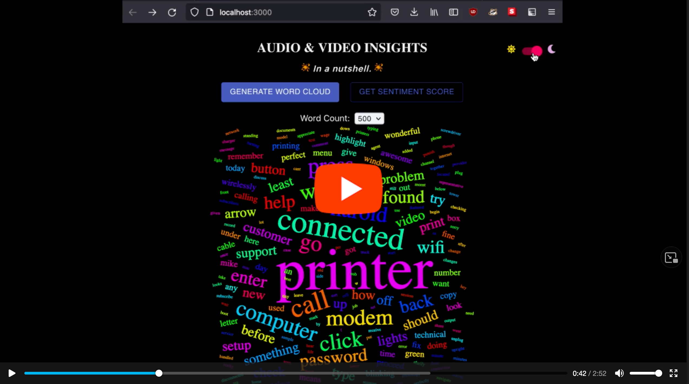

# Symbl Audio Insights

 

## Table of Contents 
**[Installation](#installation)** &nbsp;| &nbsp; **[Configuring your environment](#configuring-your-environment)** &nbsp; | &nbsp; **[Video Demo](#video-demo)** &nbsp; | &nbsp; **[The Vision](#the-vision)** &nbsp; | &nbsp; **[Challenges / Limitations](#challenges-and-limitations)** &nbsp;

 

## Installation 
1. Clone this repository
2. Rename **`.env.example`** to **`.env`** and configure the environment variables (see below for more info)
3. Run **`npm run install-all`** from the root directory to install all dependencies
4. Run **`cd server && npm start`** to run the node server on localhost:5000
5. Run **`cd client && npm start`** in a new Terminal tab to start the React app on localhost:3000

### Configuring your environment

In order to generate audio insights from the app, you first need to generate an Access Token from Symbl for authentication. **[Sign up for a free Symbl developer account](https://platform.symbl.ai/#/signup)** to get your Symbl API Credentials and **[follow this guide](https://docs.symbl.ai/docs/developer-tools/authentication/)**. Once you have completed this step, you will need to upload your own audio to Symbl. The audio file format must be one of: audio/wav, audio/mpeg, audio/mp3 or audio/wave, and it must be a raw file with only a Mono Channel. Once you have your audio, set **`AUDIO_URL`** to your audio's file path in **`.env`** (remember, this is the **`.env.example`** template file that you will need to rename to **`.env`** and populate with your own values).

Next, go to **`server/index.js`**, uncomment **`audioService.postAudio()`**, and save the file once. Check the Terminal tab where you started the server. You should see **[a log outputting the response body](./client/public/static/img/POST-audio-success.png)**. Copy the **`conversationId`** value and paste it into **`.env`**. Comment out **`audioService.postAudio()`** in  **`server/index.js`** (so that it doesn't run again) and save the file. Now the app is ready to generate insights for the audio you've just uploaded. Follow these steps any time you want to process new audio. 

It's a PITA, but these manual steps are necessary because I haven't set up a front end audio file uploader yet.

 

## Video Demo

 

## The Vision
**Issues & Incidents Tracker** &nbsp; ★ &nbsp; **Sentiment Analysis**

Trackers, speaker diarization, bulk audio uploads, combined with custom queries and data inputs can  provide interesting & useful insights on aggregate data. Symbl's APIs can be used to address specific questions like... 

- What % of 100+ inbound technical support calls are incidents related to troubleshooting printers? How long on average does it take (how much time is spent) on resolving these issues? 
- What % of calls pertaining to XYZ product during the holiday promotional sale were focused on refunds/returns in December of 2020 ? 
- What's the accuracy rate of calls forwarded to the correct business extensions? How many redirects before a customer's ticket/case is closed/resolved?

**An Organizational Tool**
 - Adaptable to the needs of a broad audience - working professionals, students, professors, content creators - anyone looking to filter & organize several tens to hundreds of unlabeled/mislabeled, hour long audio files (lecture recordings, business meetings, raw video footage, webinars, speeches, interviews, podcasts, etc.) without needing to sit through and listen to every single audio merely to extract their agendas.

**For Marketing & Customer Retention**
 - Customer segmentation + follow-ups based on overall sentiment analysis detected from phone calls. Better understanding purchase activity, promotions, and customer journeys. Categorize calls into batches by buyer stage - awareness, consideration, intent, purchase, and repurchase.

  

## Challenges and Limitations
### Prototype specific
This prototype currently only supports basic insights for single, asynchronous audio without an option to upload audios via the front end interface. This means that the conversation ID must be obtained & inserted in server side code). There is also a known limitation with Cross-Origin Request Blocked (CORB), where certain audio transcripts + Quick Charts API trigger this blocking in spite of the **`crossOrigin="anonymous"`** attribute added to **``**. This could be caused by trying to upload an audio above a certain file size limit. Although unadvised, this protection setting can be temporarily disabled during local development. The Access-Control Headers needs to be set as a more permanent solution.

The word cloud should not include any stop words. I defined merged Sets of stop words (manually) for filtering, but the ideal and more efficient approach would be to fetch all words from some dictionary API containing a list of common words, or to scrape a web page, **[like this one](https://countwordsfree.com/stopwords)**), which lists nearly 1,000 stop words. The current algorithm implemented in my code ignores several of the most frequently used words, but it does so in an inefficient way that cannot be sustained as the Set of stop words continues to grow. Removing several hundreds of stop words from each transcript at optimal performance time requires a change in algorithmic approach.

 

### Symbl + Quickchart API Limitations
Symbl Async Audio API - I provided a vocabulary list to **`trackers`** param for **`POST Audio`** and found that it decreased the accuracy of the sample audio that I had tested. But perhaps I was feeding the data incorrectly. 

Symbl Conversation API's speech to text transcription is mostly accurate, but I've spotted a few misspellings here and there that changed the meaning or negatively affected an action item. Handling such data requires having checks in place. Here are two examples:
 

**[Speech to Text Error - Example 1](./client/public/static/img/follow-up-inaccurate.png)** &nbsp; ~ &nbsp; **[Speech to Text Error - Example 2](./client/public/static/img/question-inaccurate.png)**

Occassionally, an error arises with POST audio via the Async Audio API that obstructs workflow: 

**[POST Audio Error](./client/public/static/img/POST-audio-error.png)**

 

With QuickChart Word Cloud API, I set **`removestopWords`** to true. However, this did not appear to have any effect on removing stop words from the word clouds that were rendered.